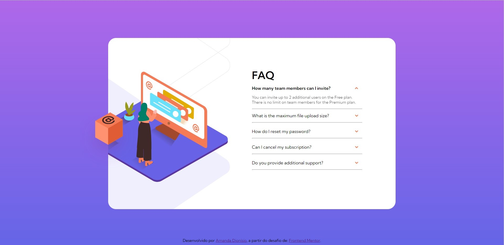
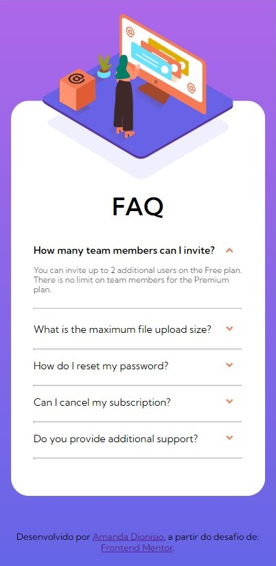

<h1 align="center">Card de Dúvidas Frequentes</h1>

    
    
    
    
    

  
   

 

  
Resolução do desafio <a href="https://www.frontendmentor.io/challenges/faq-accordion-card-XlyjD0Oam" alt="Link para o challenge">FAQ accordion card challenge on Frontend Mentor</a>.
 

<ul>Conteúdos
  <li><a href="#visao-geral">Visão Geral</a> 
    <li><a href="#o-desafio">O Desafio</a></li>
  </li>  
  <li><a href="#meu-processo">Meu processo</a></li>
    <li><a href="#aprendizados">Aprendizados</a></li>
  </li>  
  <li><a href="#autora">Autora</li>
</ul>

<h2 id="visao-geral">Visão Geral</h2>

<h3 id="o-desafio">O desafio</h3>
<ul>Os usuários devem ser capazes de:
  <li>Visualizar corretamente o layout do site, dependendo do tamanho da tela do dispositivo</li>
  <li>Ver os estados de foco ativo para todos os elementos interativos da página</li>
  <li>Mostrar/esconder a resposta para um questão quando ela for clicada</li>
</ul>  

<h2 id="meu-processo">Meu processo</h2>

<h3 id="aprendizados">Aprendizados</h3>

<ul>Os aprendizados desenvolvidos e fixados durante a execução desse projeto fora:
  <li>Manipulação de elementos com o DOM e Javascript para ativar funcionamento especifico do botão com eventListeners</li>
  <li>Uso do de botão com função de recolher/mostrar o conteúdo em HTML e CSS</li>
  <li>Uso das funções hover e utilizando a criação de classes em JS para manipular estilizações em CSS</li>
  <li>Reforçando conhecimentos de HTML e CSS já trabalhados em projetos anteriores:
    <li>Responsividade web</li>
    <li>Posicionamento, espaçamento e distribuição de elementos em CSS</li>
    <li>Flexbox e suas respectivas propriedades</li>
    <li>Display grid</li>
  </li>
</ul>

<h2 id="autora" align="left">Autora</h2>

<a href="https://github.com/amandafd">Amanda Dionisio</a>
<h3 align="left">Você me encontra nas redes sociais:</h3>

  
  
  

